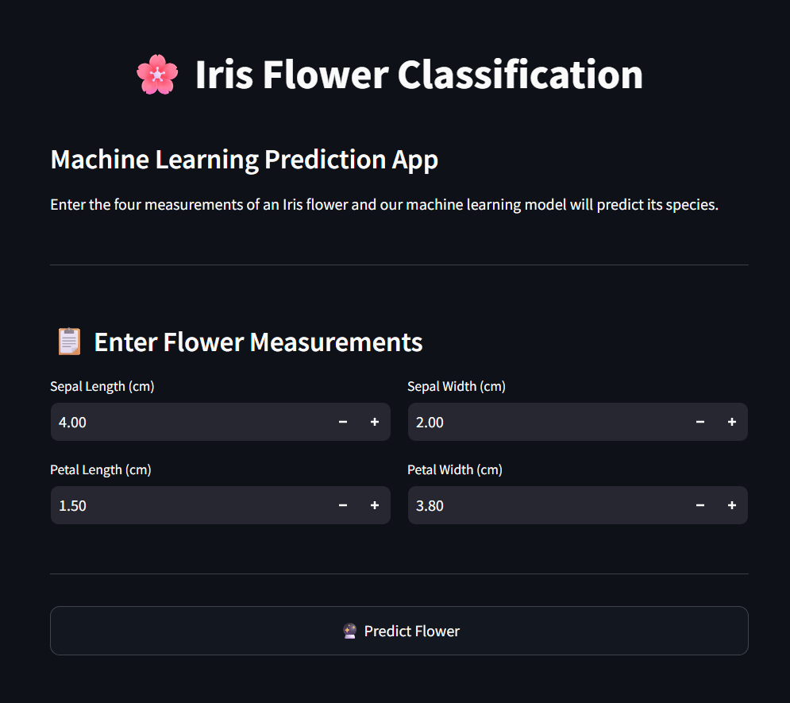
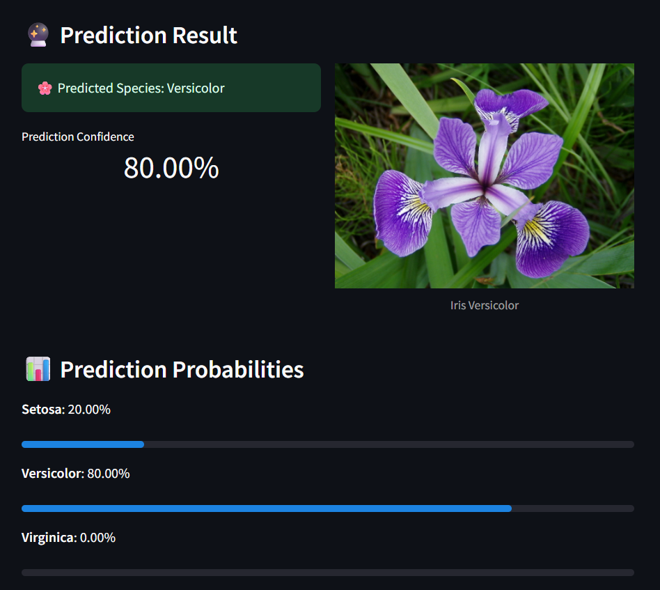

# 🌸 Iris Flower Classification

A Machine Learning web application that predicts the species of an Iris flower based on four flower measurements using the K-Nearest Neighbors (KNN) algorithm.

---

## 🚀 Live Demo

🔗 https://iris-flower-classification-w9hx6arklbj2naxatalzsf.streamlit.app/

---

## 📌 Project Objective

The objective of this project is to classify Iris flowers into one of three species:

- Iris Setosa
- Iris Versicolor
- Iris Virginica

using Machine Learning based on flower measurements.

---

## 🛠 Technologies Used

- Python
- Streamlit
- Scikit-learn
- Pandas
- NumPy

---

## 📊 Machine Learning Algorithm

This project uses the **K-Nearest Neighbors (KNN)** Classification Algorithm.

The model predicts the flower species by comparing the input measurements with the nearest flowers in the dataset.

---

## 📏 Input Features

The application accepts four measurements:

- Sepal Length (cm)
- Sepal Width (cm)
- Petal Length (cm)
- Petal Width (cm)

---

## 🌼 Flower Species

- Iris Setosa
- Iris Versicolor
- Iris Virginica

---

## 🖥️ Application Screenshots

### Home Page



### Prediction Result



---

## 📂 Project Structure

```
Iris-Flower-Classification
│
├── app.py
├── Iris_Flower_Classification.ipynb
├── README.md
├── requirements.txt
│
└── images
    ├── setosa.jpg
    ├── versicolor.jpg
    ├── virginica.jpg
    ├── app-home.png
    └── prediction-result.png
```

---

## ⚙️ Installation

Clone the repository

```bash
git clone https://github.com/tejaswini24-student/Iris-Flower-Classification.git
```

Install dependencies

```bash
pip install -r requirements.txt
```

Run the application

```bash
streamlit run app.py
```

---

## 🎯 Result

The application predicts the Iris flower species along with prediction probabilities using a trained KNN Machine Learning model.

---

## 👩‍💻 Developed By

**Tejaswini .K**
B.Tech CSE (AI & ML)
